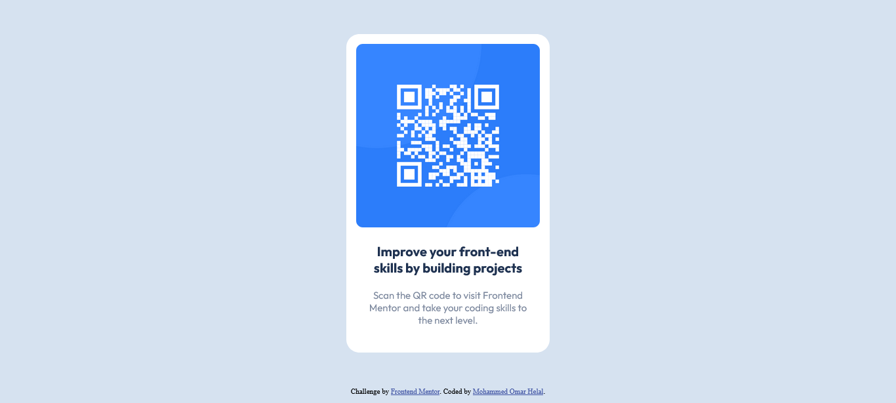

# Frontend Mentor - QR code component solution

This is a solution to the [QR code component challenge on Frontend Mentor](https://www.frontendmentor.io/challenges/qr-code-component-iux_sIO_H). Frontend Mentor challenges help you improve your coding skills by building realistic projects.

## Table of contents

- [Overview](#overview)
  - [Screenshot](#screenshot)
  - [Links](#links)
- [My process](#my-process)
  - [Built with](#built-with)
  - [What I learned](#what-i-learned)
  - [Continued development](#continued-development)
- [Author](#author)
  **Note: Delete this note and update the table of contents based on what sections you keep.**

## Overview

### Screenshot

### Links

- Solution URL: [QR Code Github Repo](https://github.com/MohammedHelal/qr-code)
- Live Site URL: [QR Code Github Pages](https://mohammedhelal.github.io/qr-code/)

## My process

### Built with

- Semantic HTML5 markup
- CSS custom properties
- Flexbox
- [React](https://reactjs.org/) - JS library
- [Vite](https://vitejs.dev/) - JS and React Build Tool

### What I learned

This is the first time I have used Github pages to host an app I built.
This process was a bit difficult at first since I used vite to build the app and I didnt know the process to deploy and host on github pages, below are the links I used to learn this process.

- [Deploying Vite / React App to GitHub Pages](https://reactjs.org/) - this link shows the process to deploy vite to github pages using VS Code.
- [Github Actions and Workflows](https://github.com/sitek94/vite-deploy-demo) - this repo describes the process of deploying the app and showsa workflow you can copy to help you start.

### Continued development

I will continue learning more about github and github pages until I am more comfortable using them.

## Author

- CodeSandBox - [MohammedHelal](https://codesandbox.io/u/MohammedHelal)
- Frontend Mentor - [@MohammedHelal](https://www.frontendmentor.io/profile/MohammedHelal)
